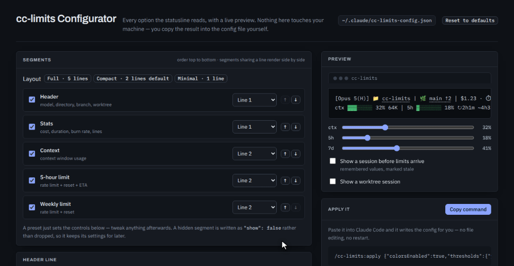

<h1 align="center">cc-limits</h1>

<p align="center">
  <b>Know how much Claude you have left — before Claude tells you.</b><br>
  A Claude Code statusline that puts your 5-hour and weekly rate limits, your context window,<br>
  and what this session is costing you on one line you never have to think about.
</p>

<p align="center">
  <a href="https://www.claudepluginhub.com/plugins/sslinnn-cc-limits-plugin?ref=badge"></a>
  
  
</p>

<p align="center">
  
</p>

Two lines, because a statusline you glance at shouldn't cost a third of a short terminal. Green under 70%, yellow from 70, red from 90 — per bar, so the one that's actually in trouble is the one that changes color. Want it spread out over five lines, or squeezed onto one? [One button either way](#make-it-yours) — every option is a page you click through with a live preview, and you never open a config file.

---

## Why

Claude Code tells you that you've hit your limit. It doesn't tell you that you're *about* to.

cc-limits turns both rate-limit windows into something you can plan around: how full they are, when they reset, and — measured from how fast the window is actually filling — roughly **when you'll run out**. Same for the context window, so a compaction never lands as a surprise mid-refactor.

## Install

```
/plugin marketplace add sslinNn/cc-limits
/plugin install cc-limits@cc-limits
```

Start a new session. That's it — the `SessionStart` hook copies the script to `~/.claude/cc-limits-statusline.js` and wires up `~/.claude/settings.json` for you. Nothing to edit by hand.

Already using a different statusline? cc-limits leaves it alone and hands you a ready-to-paste snippet in case you want to switch.

**Needs:** Node on your PATH, and a Claude.ai Pro/Max subscription for the `5h`/`7d` bars — Claude Code only sends `rate_limits` to subscribers, after a session's first API response. The `ctx` and `stats` segments work for everyone.

## What you get

| Segment | Renders |
|---|---|
| `header` | Model with effort tier and fast-mode `↯`, directory, git branch with `↑ahead ↓behind`, and the `🌳 worktree` name during a `--worktree` session |
| `ctx` | Context bar, percentage, and `used/total` tokens |
| `5h` | 5-hour limit bar, countdown to reset, and `~ETA to limit` at your current pace |
| `7d` | Weekly limit bar; its countdown reads in days (`6d3h`) |
| `stats` | `$cost · ⏱ duration · 🔥 tokens/min · +added -removed`, plus an optional `api %` share |

### The ETA is measured, not guessed

`~4h33m to limit` comes from the slope of the window itself — sampled over the session, so it counts usage from your **other** sessions too, not just this one. Before there's enough history to measure (the first couple of minutes) it falls back to assuming the whole window came from this session, which reads pessimistically. It hides itself when the pace is too slow to matter or the answer lands past a day, because an estimate nobody can act on is just noise.

### Your limits are there from the first render

Claude Code only puts `rate_limits` in the payload after a session's first API response — so historically the 5h/7d bars had nothing to draw exactly when you needed them most: at the start, deciding whether to begin the big task. cc-limits remembers the last values it saw and draws them with a `~` marker until the live numbers land:

```
5h~▓░░░░░░░ 18% ↻2h0m
```

A remembered value is dropped the moment its window resets (the number would be a lie) or once it's more than 12 hours old. Remembered values never show an ETA — that usage predates the session, so estimating from the session's runtime would invent a burn rate out of nothing.

## Usage examples

### Read the line

Nothing to run — it's there from the first render of a new session.

```
[Opus 5(H)] 📁 my-project | 🌿 main ↑2 │ $1.23 · ⏱ 1h0m · 🔥 1.1K/min · +320 -85
ctx ▓▓▓░░░░░ 32% 64K │ 5h ▓░░░░░░░ 18% ↻2h1m ~4h33m │ 7d ▓▓▓░░░░░ 41% ↻6d3h
```

The two notes on `5h` are the whole point: `↻2h1m` is when the window resets, `~4h33m` is when you'd hit the limit at your current pace. As long as the reset lands sooner than the ETA, you're fine. When the ETA drops under the countdown — `↻3h20m ~40m` — you have 40 minutes at this pace before you're stuck for three, and that's the moment to leave the big refactor for tomorrow.

### Change one thing, conversationally

```
/cc-limits:setup
```

Claude reads your current config, asks a handful of questions, and writes the file. Answers can be as loose as *"drop the weekly bar and make the context one red at 80"* — it maps them onto the schema and tells you what changed. Takes effect on the next render, no restart.

### Change everything at once, visually

```
/cc-limits:configure
```

Opens the configurator in your browser with your live config already loaded — every option with a preview of your actual statusline. Tweak, hit **Copy command**, paste the result back:

```
/cc-limits:apply {"colorsEnabled":true,"thresholds":{"yellow":70,"red":90},…}
```

`/cc-limits:apply` validates it, says in plain language what's about to change, and writes it.

### Squeeze it onto one line

For a short terminal, or a split pane. Click **Minimal** in the configurator, or ask `/cc-limits:setup` for "one line, no bars, just the numbers":

```
[Opus 5(H)] 📁 my-project | 🌿 main │ ctx 32% │ 5h 18% ↻2h1m │ 7d 41% │ $1.23
```

Every bar goes to `"row": 1` with `"showBar": false` — the percentage inherits the color the bar was carrying, so you still get the green→yellow→red warning in a quarter of the width.

### Hide a segment you don't need

On a plan without weekly limits, or when the cost readout is a distraction:

```json
{ "id": "7d", "type": "bar", "show": false, … }
```

Use `"show": false` rather than deleting the entry — `segments` is the complete list of what renders, so a segment you remove is one `/cc-limits:setup` has to put back later.

### Plain-ASCII terminal

Some terminals and multiplexers render `▓░↻` as boxes. Swap the characters out:

```json
"bar": { "width": 8, "filledChar": "#", "emptyChar": "-", "staleMarker": "~" },
"layout": { "noteMarkers": { "reset": "r", "limit": "~" } }
```

```
ctx ###----- 32% 64K │ 5h #------- 18% r2h1m ~4h33m │ 7d ###----- 41% r6d3h
```

### Watch it from a background tab

The statusline is invisible when Claude Code isn't the focused tab, so mirror the numbers into the terminal title:

```json
"terminalTitle": { "enabled": true, "template": "ctx {ctx}% · 5h {5h}% · {dir}" }
```

The tab now reads `ctx 32% · 5h 18% · my-project` while you're somewhere else.

### Get warned earlier on the weekly window

The weekly window is the one you can't wait out, so give it its own thresholds while everything else stays at 70/90:

```json
{ "id": "7d", "type": "bar", "show": true, "thresholds": { "yellow": 40, "red": 60 }, … }
```

Now `7d` turns yellow at 40% and red at 60% — early enough to pace the rest of the week — and the other bars are unaffected.

## Make it yours

Two ways to the same result. No file editing either way.

**Answer a few questions:** run `/cc-limits:setup` and Claude writes the config for you.

**Or see every option at once:** run `/cc-limits:configure`.

<p align="center">
  
</p>

It opens [`plugin/configurator.html`](plugin/configurator.html) in your browser with your current config already loaded, and every control starts on what your statusline is doing right now. The preview at the top right is the real renderer, not a mockup — it redraws on every click, so you pick a layout by looking at it rather than by reading what `"row": 2` means. Sliders show exactly where your color thresholds land, and **Reset to defaults** undoes an afternoon of tweaking. One self-contained page: no server, no install, no network.

Hit **Copy command**, paste into Claude Code:

```
/cc-limits:apply {"colorsEnabled":true,...}
```

`/cc-limits:apply` validates it, tells you in plain language what's about to change, and writes the file. Opened the page some other way? Paste any config into its **Start from your current config** box — a wrapped terminal dump or a fenced block copied out of chat parses fine.

### Layouts

The default is two lines. The configurator has **Full**, **Compact** and **Minimal** as buttons — each is just a batch of settings you can keep tweaking afterwards.

**Full — five lines**, one per segment, the pre-1.4 look:

```
[Opus 5(H)] 📁 my-project | 🌿 main
ctx ▓▓▓░░░░░░░ 32% 64K/200K
5h  ▓▓░░░░░░░░ 18% (2h1m until reset, ~4h33m to limit)
7d  ▓▓▓▓░░░░░░ 41% (6d3h until reset)
$1.23 · ⏱ 1h0m · 🔥 1.1K/min · +320 -85
```

**Minimal — one:**

```
[Opus 5(H)] 📁 my-project | 🌿 main │ ctx 32% │ 5h 18% ↻2h1m │ 7d 41% │ $1.23
```

Three independent knobs do the work:

- **Lines.** Segments with the same `"row"` number render side by side, joined by `layout.joiner` (default ` │ `). `"row": null` puts one back on a line of its own — spell it out, since a missing `row` inherits the default's.
- **Note length.** `"layout": { "noteStyle": "full" }` spells the notes out — `(3h53m until reset, ~3h0m to limit)` instead of `↻3h53m ~3h0m` — and brings back the context window's total next to the token count. Set it per segment to mix both styles; pick your own symbols with `"noteMarkers": { "reset": "r", "limit": "~" }` if your terminal can't draw the arrow.
- **Bars.** `"showBar": false` leaves just `5h 40%` — and the percentage takes over the color the bar was carrying.

### Terminal title

The statusline is invisible when Claude Code sits in a background tab. cc-limits can mirror the numbers into the terminal title instead:

```json
"terminalTitle": { "enabled": true, "template": "ctx {ctx}% · 5h {5h}% · {dir}" }
```

Placeholders: `{ctx}` `{5h}` `{7d}` `{cost}` `{dir}` `{model}` — percentages are bare numbers, empty when unknown. The escape goes straight to `/dev/tty` (stdout belongs to Claude Code), which also means it quietly does nothing on Windows or without a controlling terminal. Off by default, because it writes outside our own line.

### Clickable links

The directory is an OSC8 link to the folder and the branch links to its remote on GitHub/GitLab — click either straight from the statusline. Terminals without OSC8 support just print the text, so there's nothing to turn off for them. If you'd rather save the one extra `git remote get-url` the branch link costs per render, set `{ "key": "branch", "link": false }`.

### Defaults

| Setting | Default |
|---|---|
| Segments (in order) | header (model, dir, branch, worktree) + stats on line 1; ctx, 5h, 7d on line 2 |
| Colors | green `<70%`, yellow `70–89%`, red `≥90%` |
| Bar | width 8, `▓` filled / `░` empty |
| Countdown to reset | 5h and 7d |
| ETA to limit | 5h |
| Context tokens | shown |
| Clickable dir and branch | on |
| Icons | 📁 dir · 🌿 branch · 🌳 worktree · ⏱ duration · 🔥 burn rate |
| Layout | two lines, short notes, bars shown |
| Remembered limits | on, `~` marker, 12-hour max age |
| Terminal title | off |

Thresholds and colors are overridable per segment too — so the weekly bar can go red at 50% while everything else stays at 90%.

## How it works

Everything on the line comes from the JSON Claude Code already pipes into your statusline command ([docs](https://code.claude.com/docs/en/statusline)). **No polling, no API calls, no daemon, no telemetry, zero dependencies** — one Node script using nothing but the standard library.

The only thing written to disk is `~/.claude/cc-limits-state.json`: the last rate-limit values plus a short sample history per window, which is what makes the ETA a measurement instead of a guess. Samples are taken at most every 30 seconds, capped at 60 per window, and thrown away when a window rolls over. The file is a few hundred bytes, written only when something actually changed, and replaced atomically so parallel sessions can't tear each other's history. Don't want it at all? `"state": { "enabled": false }` — the bars then simply stay hidden until live limits arrive.

The effort tier is read from `effortLevel` in `~/.claude/settings.json` (or `CLAUDE_CODE_EFFORT_LEVEL`), since Claude Code doesn't put it in the payload; unset renders as `H`, Claude Code's own default, and it's hidden for Haiku, which has no tier.

Prefer editing JSON directly? The config is plain JSON at `~/.claude/cc-limits-config.json`, matching the schema documented in [`plugin/commands/setup.md`](plugin/commands/setup.md). Note that `segments` is the **complete** list of what renders — a segment you leave out is hidden, so after an update that adds a new one, run `/cc-limits:setup` (or add it yourself) to pick it up.

## Update

```
/plugin marketplace update cc-limits
```

The `SessionStart` hook re-copies the script next session, so `~/.claude/cc-limits-statusline.js` always matches the installed version.

## License

MIT
